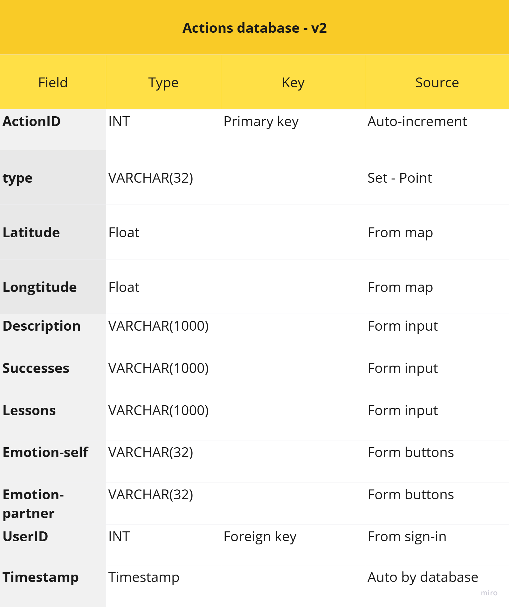
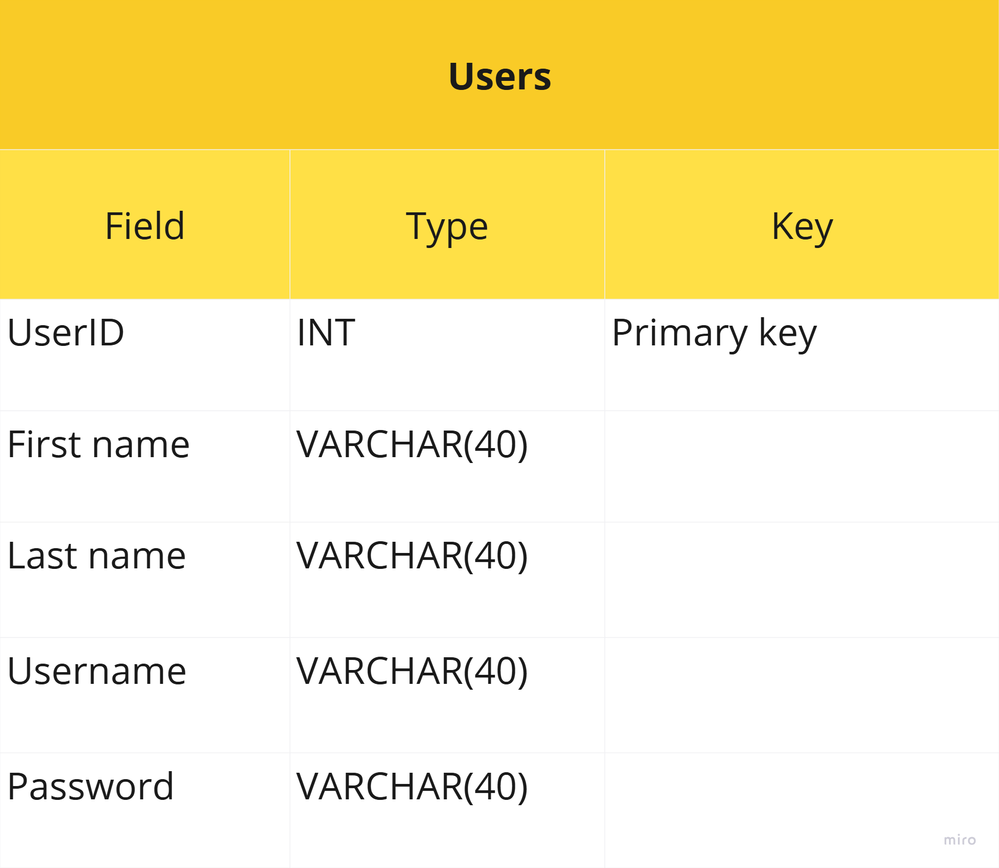
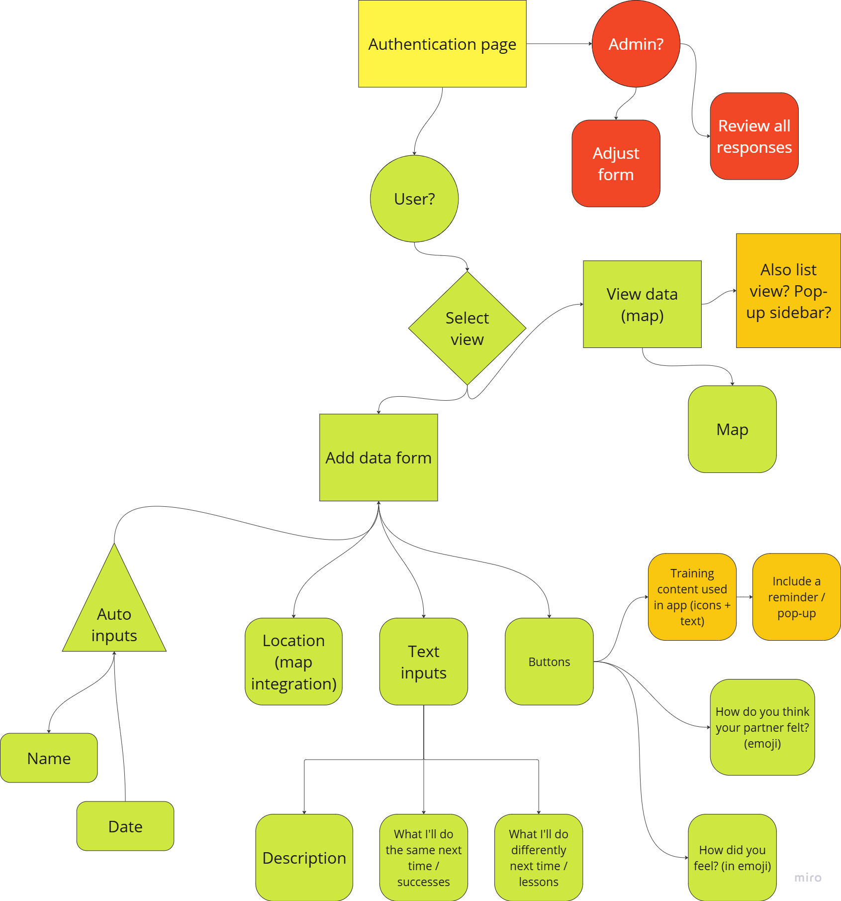

# MVP - Siri Pantzar

This is a student project for Codeop's Fullstack bootcamp.

---
Many organisations and companies deliver interventions aiming to inspire action. In order to evaluate the impact of their interventions, they need data from participants, often long after the intervention.

Participants rarely have a clear incentive or reminder to submit the required information. So they don't.

This app aims to address this discrepancy. The initial version is built for interventions aiming to inspire climate change conversations, but it should be easily modifiable for other intervention types.

## Needs analysis

The main organisational and user needs considered in the project design are as follows:

### User needs

- Quick and intuitive to fill out - not too long
- Handy to fill out immediately following action - submit one action at a time, mobile-friendly, direct link to form
- Control over own data - can see and delete own submissions
- Some benefit to self - see own and others' submissions for learning, sharing, inspiration
- Feels real - use map to ground data in real world

### Organisation needs

- All data saved and easily available
- Quantitative and qualitative inputs
- Feels real - use map to ground data in real world

## Technical details

### Back-end

The app uses a MySQL database with two connected tables: actions and users. The actions table is the main element of the app at this stage. The users table is primarily made available for future development.

Here are tables demonstrating the database.

Actions table:

Users table:

The actions router includes APIs for:

- accessing all actions, with a left join to also access relevant username
- adding a new action
- accessing a specific action (currently not in use)
- deleting an action

### Front-end

The front-end uses React Router to create separate URLs for the two main pages. It uses fonts imported from Google Fonts.

The pages are: a landing page which also renders the map page; and a form page which appears as a sliding side panel.

The maps are created using leaflet.js and with stadia map tiles & OpenStreetMap data through an API. Markers and marker pop-ups are customised. API key is not needed for using the map tiles and data while working in localhost.

The form uses standard inputs as well as a location selection map (in a separate component) and an emoji selector (in a separate component).

Here is a somewhat complex graph with the user journey I was hoping for (green: done, red, yellow and orange: not done)

## Set-up

### Dependencies

- Run npm install in the project folder
- cd client and run npm install in the client folder
- install react, react-tooltip, and react-router-dom in the client folder
- run npm install --save leaflet react-leaflet in the client folder

### Database Prep

1. Create a database called impactmap
2. Create an .env file with the following inputs (each on a separate row, no bullet points):
    - DB_HOST=localhost
    - DB_USER=root
    - DB_NAME=impactmap
    - DB_PASS=[insert your MySQL password here]
3. Run npm run migrate in your terminal in the project folder. This will create two tables: users and actions, and add some initial values to both databases.

### Run Your Development Servers

- run npm start in project directory to start Express server on port 5000
- cd client and run npm run dev in client folder to start client server in development mode in port 5173
- Client is configured so all API calls will be proxied to port 5000 for a smoother development experience.
- You can test your client app in `http://localhost:5173`
- You can test your actions API in `http://localhost:5000/api/actions` . The users database is currently only used where linked to actions, and does not have API calls. It can be modified in MySQL.

### Feature extensions

- Add an address layer to the map so users can search for a location insted of just using coordinates through the map or current location. This is especially important for accessibility.
- An authentification process and an admin view, plus an individual user view for each user.
- A side panel / view that shows all the actions as a list, and perhaps allows filtering (own actions, all actions, actions this week etc.)
- I'd like for users to be able to choose what marker to use for their actions and for those to show on the map. And/or for the markers for the user's own actions to be different from other people's markers (eg a different color)
- Some gamification features - eg likes, or badges for users who have submitted 5/10/20 actions, etc.

### Credits

- **Fonts** : Montserrat, designed by Julieta Ulanovsky, Sol Matas, Juan Pablo del Peral, Jacques Le Bailly; and Sour Gummy, designed by Stefie Justprince. From Google Fonts.
- **Icons** : Pulsar Color icons from icons8. I drew the logo!
- **Map tiles** : Alidade Smooth by Stadia Maps
- **Map data** : OpenStreetMap
